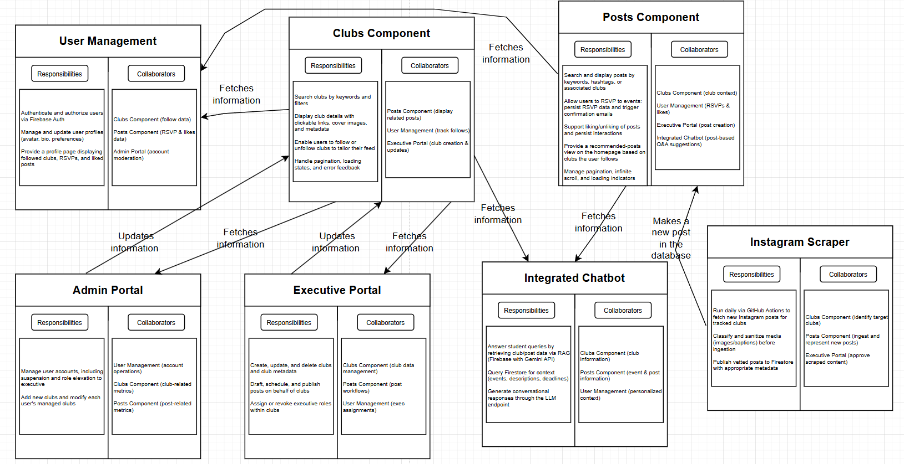
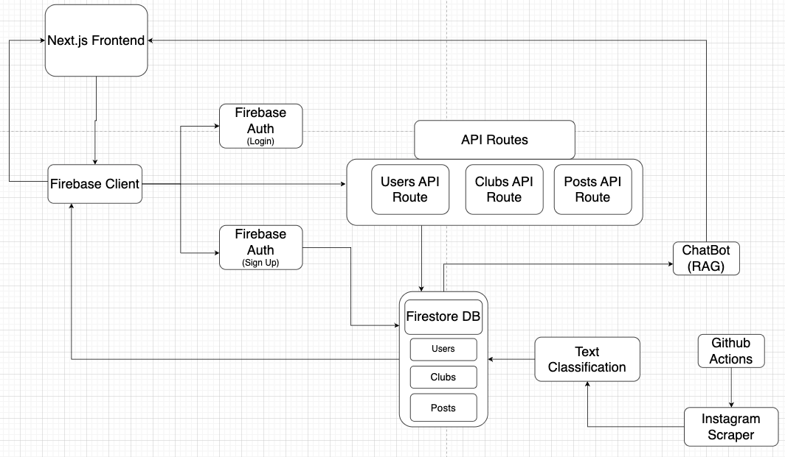

# System Design Document

## Overview

This document outlines the technical architecture, dependencies, and design rationale for the **Campus Compass** website.
The system integrates various technologies including Firebase, Next.js, and GitHub Actions for scalable and real-time performance.

## CRC Cards

## System Architecture

## Interactions & Dependencies

| Component            | Technology Used | Purpose |
|---------------------|-----------------|---------|
| **Frontend**         | Next.js (React) + Tailwind CSS | Interactive UI, handles navigation, user actions, and dynamic content rendering |
| **Backend**          | Next.js API Routes | Handles CRUD operations via Users, Clubs, and Posts endpoints |
| **Database**         | Firebase Firestore | NoSQL store for users, clubs, and posts data |
| **Authentication**   | Firebase Auth     | Manages user login and signup |
| **External API**     | Instagram Scraper via GitHub Actions | Scrapes Instagram posts daily for clubs (priority moved to “nice to have”) |
| **Text Classification** | Hugging Face (API) | Categorizes scraped content (event, hiring, etc.) |
| **Chatbot**          | Retrieval-Augmented Generation (RAG) + Gemini | Provides Q&A features over club data |
| **Main Platform**    | Web App           | Centralized platform for UofT clubs and students |

## Assumptions

- Users will have a working internet connection.
- Users will access the platform primarily via modern web browsers (Chrome, Firefox, Safari).
- Firebase operations (reads/writes/auth) will remain available and functional.
- Students will have UofT emails to authenticate via Firebase Auth.
- GitHub Actions will have permission to run daily jobs for scraping without requiring manual triggers.
- Gemini or another LLM-based service will be available via API for chatbot support with acceptable latency.

## Error Handling

| Potential Error                 | Solution |
|-------------------------------|-------------------|
| Auth token expired/invalid    | Prompt user to re-login, refresh token via Firebase Auth |
| Firestore read/write failure  | Use try-catch, show error message or retry action |
| Chatbot returns invalid info  | Fallback message: “I couldn't find that info” with context-based suggestions |
| Rate limit on API routes      | Implement backoff, retry queue, and quota monitoring |
| Client-side crash             | React error boundaries, fallback UIs, and bug logging |

## Design Rationale

- **Firebase** was chosen for ease of integration, real-time data sync, and robust auth features.
- **Next.js** enables full-stack development using API routes and server-side rendering where necessary.
- **Tailwind CSS** speeds up UI development while keeping designs consistent and modern.
- **Chatbot (Gemini + RAG)** improves UX by reducing navigation and surfacing contextual answers instantly.
- **Instagram scraping** is meant to automate content ingestion.
